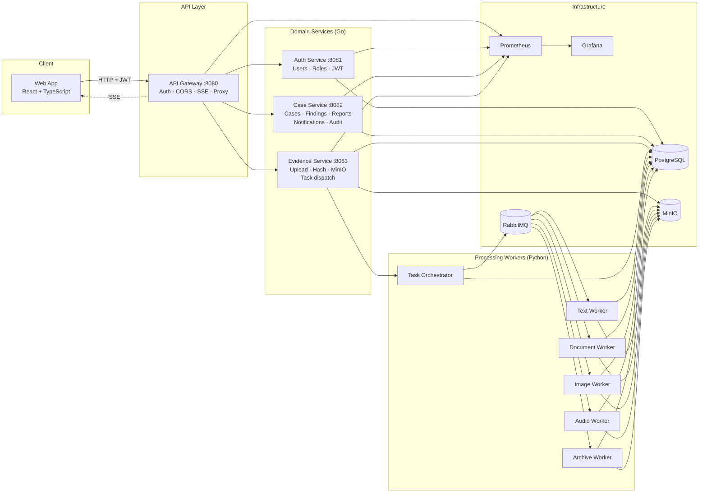

# SecureWatch

**Open-source distributed platform for digital evidence analysis.**

SecureWatch receives, validates, stores, processes, and reports on digital evidence through a decoupled microservices architecture. Cases are created, evidence is uploaded and automatically queued for specialized workers, findings are registered with severity scores, and a consolidated report is generated — all in a single platform with real-time updates and a full audit trail.

> Built as a portfolio-grade distributed system. All services run locally through Docker Compose with a single command.

---

## Features

### Case Management
- Create, update, filter, and archive investigation cases
- Priority levels: Low, Medium, High, Critical
- Status lifecycle: Open → In Progress → Closed → Archived
- Risk score calculated from findings severity

### Evidence
- Multi-file and folder upload with client-side MIME type filtering
- File validation (type, size, SHA-256 deduplication per case)
- Supported types: images, audio, documents (PDF/Office), archives, text/CSV/XML/JSON
- Real-time status updates via Server-Sent Events

### Automated Processing
- Evidence classified and routed to the right worker automatically
- **Text worker** — keyword extraction, entity detection, risk pattern matching
- **Document worker** — PDF/Office text extraction → feeds text worker
- **Image worker** — object detection, metadata extraction
- **Audio worker** — Whisper transcription → feeds text worker
- **Archive worker** — recursive content inspection, suspicious file detection
- Findings registered with severity (low / medium / high / critical)

### Reports
- One-click PDF report generation per case
- Summary: risk score, findings breakdown, evidence list
- Downloadable via presigned MinIO URL

### Security & Audit
- JWT authentication (HS256)
- Role-based access: Admin, Supervisor, Analyst
- Immutable audit trail for every sensitive action
- Audit log filterable by actor, action, and resource type

### Observability
- Prometheus metrics on all Go services (`/metrics`)
- Grafana dashboard: service health, request rate, error rate, uptime
- RabbitMQ Management UI for queue inspection

### Real-Time
- SSE stream per case — live evidence status, findings, notifications
- Bell icon with unread count in sidebar
- Auto-refresh on new high/critical findings

---

## Architecture



---

## Quick Start

### Prerequisites
- Docker Desktop
- Go 1.22+
- Python 3.11+
- Node.js 20+

### 1. Clone and configure

```bash
git clone https://github.com/CodeG-2021/SecureWatch.git
cd SecureWatch
cp .env.example .env
```

Edit `.env` and set strong passwords for production. The defaults in `.env.example` are safe for local development.

### 2. Start everything

```bash
make up
```

This starts Docker infrastructure (Postgres, RabbitMQ, MinIO, Prometheus, Grafana) + all Go services + Python workers + the Vite dev server.

### 3. Open the app

| Service | URL |
|---|---|
| **Web App** | http://localhost:3000 |
| **API Gateway** | http://localhost:8080 |
| **Grafana** | http://localhost:3001 |
| **RabbitMQ UI** | http://localhost:15672 |
| **MinIO Console** | http://localhost:9001 |
| **Prometheus** | http://localhost:9090 |

### 4. Stop everything

```bash
make down
```

---

## Project Structure

```
SecureWatch/
├── apps/
│   └── web/                    # React + TypeScript + Tailwind frontend
│
├── services/
│   ├── api-gateway/            # HTTP entry point, auth middleware, SSE, proxying
│   ├── auth-service/           # Users, roles, JWT issuing
│   ├── case-service/           # Cases, findings, reports, notifications, audit
│   ├── evidence-service/       # Upload, validation, hashing, MinIO, task dispatch
│   ├── task-orchestrator/      # Evidence classification, RabbitMQ publishing
│   ├── report-service/         # (planned) standalone report generation
│   └── notification-service/   # (planned) standalone notification service
│
├── services/workers/
│   ├── base/                   # Shared DB, MinIO, RabbitMQ utilities
│   ├── text-worker/            # Keywords, entities, risk patterns
│   ├── document-worker/        # PDF/Office text extraction
│   ├── image-worker/           # Object detection, metadata
│   ├── audio-worker/           # Whisper transcription
│   └── archive-worker/         # ZIP/TAR inspection
│
├── infra/
│   ├── database/init/          # PostgreSQL migration scripts (001–010)
│   ├── docker/rabbitmq/        # Exchange, queue, DLQ definitions
│   ├── docker/prometheus/      # Scrape config
│   ├── docker/grafana/         # Provisioning + dashboards
│   └── docker/minio/           # Bucket initialization
│
├── docs/                       # Full project documentation
├── docker-compose.yml
├── Makefile
└── .env.example
```

---

## Tech Stack

| Layer | Technology |
|---|---|
| Frontend | React 18, TypeScript, Tailwind CSS, Vite |
| API Gateway | Go, `net/http`, Chi router |
| Domain Services | Go, pgxpool, structured logging (`slog`) |
| Workers | Python 3.11, pika (RabbitMQ), psycopg2, boto3 (MinIO) |
| Database | PostgreSQL 16 |
| Message Broker | RabbitMQ 3.13 |
| Object Storage | MinIO |
| Observability | Prometheus, Grafana |
| Containerization | Docker Compose |

---

## Environment Variables

Copy `.env.example` to `.env`. Required variables:

| Variable | Description |
|---|---|
| `POSTGRES_PASSWORD` | PostgreSQL password |
| `RABBITMQ_DEFAULT_PASS` | RabbitMQ password |
| `MINIO_ROOT_PASSWORD` | MinIO root password |
| `JWT_SECRET` | HS256 signing secret (min 32 chars) |
| `GRAFANA_ADMIN_PASSWORD` | Grafana admin password |

See `.env.example` for the full list with defaults.

---

## Documentation

| Document | Description |
|---|---|
| [Architecture](docs/architecture.md) | System overview, principles, and main flow |
| [Container Diagram](docs/container-diagram.md) | C4-style container view with Mermaid |
| [Architecture Flows](docs/architecture-flows.md) | Upload, processing, and report sequence diagrams |
| [API Reference](docs/api-reference.md) | All REST endpoints with methods, paths, and auth |
| [Database Schema](docs/database-schema.md) | All tables, columns, and relationships |
| [Workers](docs/workers.md) | Worker pipeline, task types, and finding registration |
| [Features](docs/features.md) | Full feature list with details |
| [Service Communication](docs/service-communication.md) | Communication patterns and RabbitMQ rules |
| [Local Infrastructure](docs/local-infrastructure.md) | Docker Compose services, volumes, and ports |
| [Development Guide](docs/development.md) | Setup, conventions, and contribution workflow |
| [Commit Convention](docs/commit-convention.md) | Git commit message format |
| [ADR-0001 Monorepo](docs/decisions/ADR-0001-monorepo.md) | Decision: monorepo structure |
| [ADR-0002 Tech Foundation](docs/decisions/ADR-0002-technical-foundation.md) | Decision: technology choices |

---

## Makefile Targets

```bash
make up           # Start everything
make down         # Stop everything
make logs         # Stream Docker logs
make ps           # List Docker containers
make migrate-db   # Apply database migrations
make check-infra  # Verify infrastructure connectivity
```

---

---

## License

MIT License — Copyright (c) 2026 Greivin Gonzalez Villalobos (CodeG).  
See [LICENSE](LICENSE) for details.
