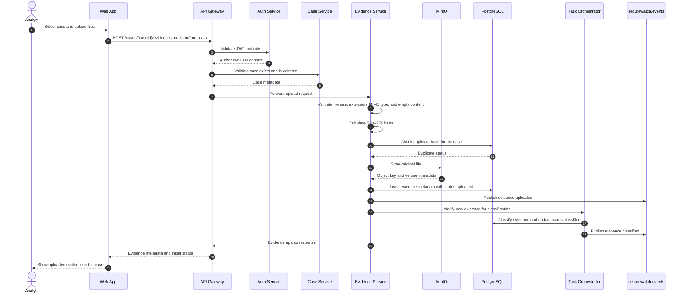
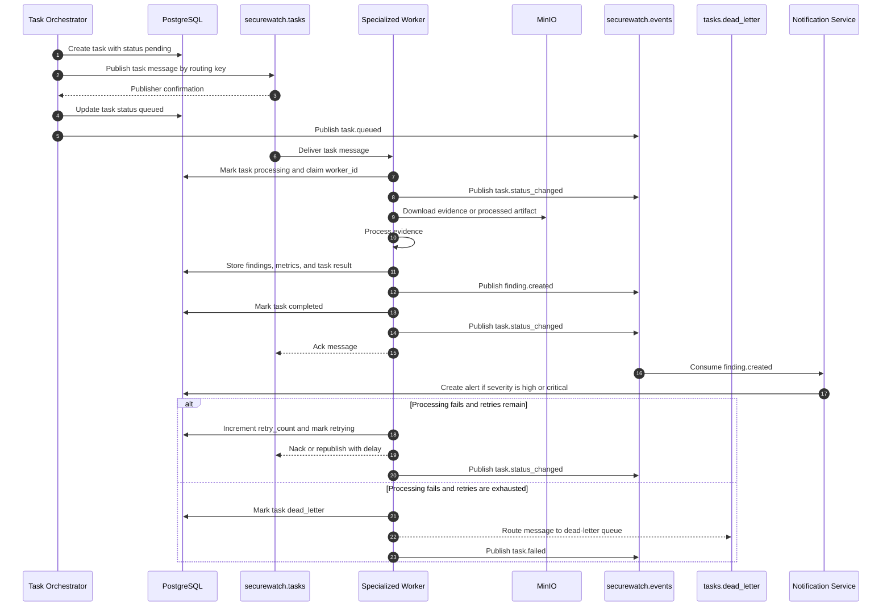
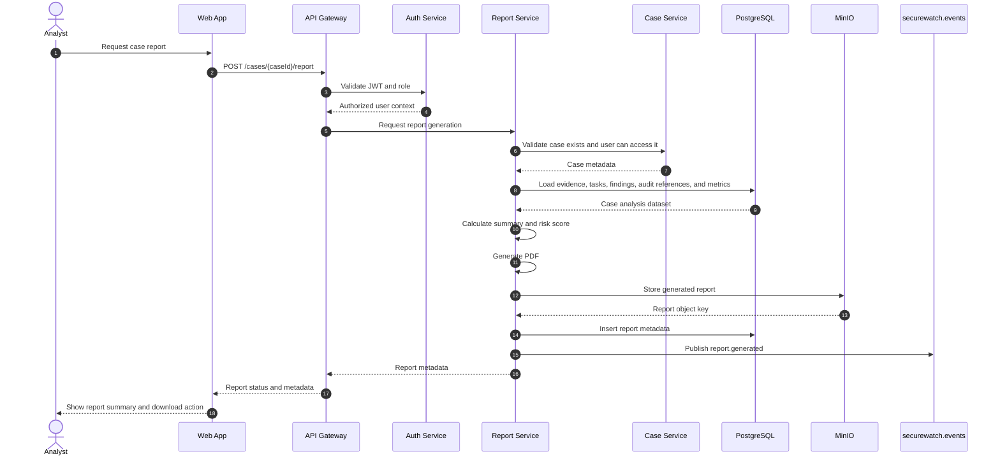

# SecureWatch Architecture Flows

This document defines the core MVP flows for evidence upload, RabbitMQ processing, and report generation.

## Evidence Upload Flow

### Upload Rules

- The API Gateway authenticates the request and forwards the user context to internal services.
- Evidence Service owns file validation, hashing, object storage, and evidence metadata.
- Original evidence files are never stored in service containers.
- MinIO stores original files under deterministic object keys that include `case_id` and `evidence_id`.
- PostgreSQL stores metadata, states, hashes, and traceability references.
- Evidence classification starts after the file and metadata are successfully persisted.

## RabbitMQ Processing Flow

### Processing Rules

- The Task Orchestrator is the only component that creates processing tasks.
- Workers consume only the queues that match their specialty.
- Task messages should contain identifiers, not full evidence content.
- Workers fetch files or artifacts from MinIO and persist results in PostgreSQL.
- Every state transition emits a domain event for dashboards, audit, and notifications.
- Failed tasks are retried up to `max_retries`; exhausted tasks move to the dead-letter queue.
- Workers must be stateless and horizontally replicable.

## Report Generation Flow

### Report Rules

- Report Service owns report composition and generated report metadata.
- Reports are generated from persisted case state, not from transient worker memory.
- Generated PDFs are stored in MinIO.
- PostgreSQL stores report metadata, status, summary, risk score, file path, and creator.
- Download endpoints should use short-lived MinIO URLs or a proxied download through the API Gateway.
- Report generation should emit `report.generated` so the dashboard can update without a manual refresh.
