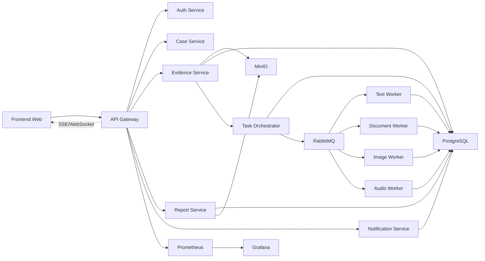

# SecureWatch Architecture

SecureWatch is a distributed platform for receiving, managing, processing, monitoring, and reporting digital evidence. The architecture separates the user interface, domain services, orchestration, specialized workers, and supporting infrastructure.

## Components

- `apps/web`: interface for administrators, analysts, and supervisors.
- `services/api-gateway`: frontend entry point, authentication, CORS, logs, real-time events, and API aggregation.
- `services/auth-service`: users, roles, and JWT.
- `services/case-service`: case lifecycle.
- `services/evidence-service`: upload, validation, hashing, MinIO storage, and metadata.
- `services/task-orchestrator`: evidence classification, task creation, and RabbitMQ publishing.
- `workers/*`: specialized processing for text, documents, images, and audio.
- `services/report-service`: consolidated reports.
- `services/notification-service`: internal alerts for high or critical severity findings.
- `infra/*`: PostgreSQL, RabbitMQ, MinIO, Prometheus, and Grafana.

## Detailed Architecture Documents

- [Container Diagram](container-diagram.md)
- [Architecture Flows](architecture-flows.md)
- [Service Communication](service-communication.md)
- [Technical Foundation ADR](decisions/ADR-0002-technical-foundation.md)

## Main Flow

1. The user signs in.
2. The user creates a case.
3. The user uploads digital evidence.
4. Evidence Service stores the file in MinIO.
5. Evidence Service persists metadata and hash in PostgreSQL.
6. Task Orchestrator classifies the evidence.
7. Task Orchestrator creates tasks and publishes them to RabbitMQ.
8. Workers consume tasks according to their specialty.
9. Workers store results, findings, and metrics.
10. Report Service consolidates case results.
11. Notification Service emits alerts for `high` or `critical` severity.
12. The dashboard shows progress through SSE, WebSockets, or polling.

## Principles

- Services decoupled by responsibility.
- Asynchronous processing through queues.
- Horizontally replicable workers.
- Traceability from case to finding.
- Reproducible infrastructure with Docker Compose.
- Observability from the start.

## Initial Diagram

For a more detailed C4-style container view, see [Container Diagram](container-diagram.md).
