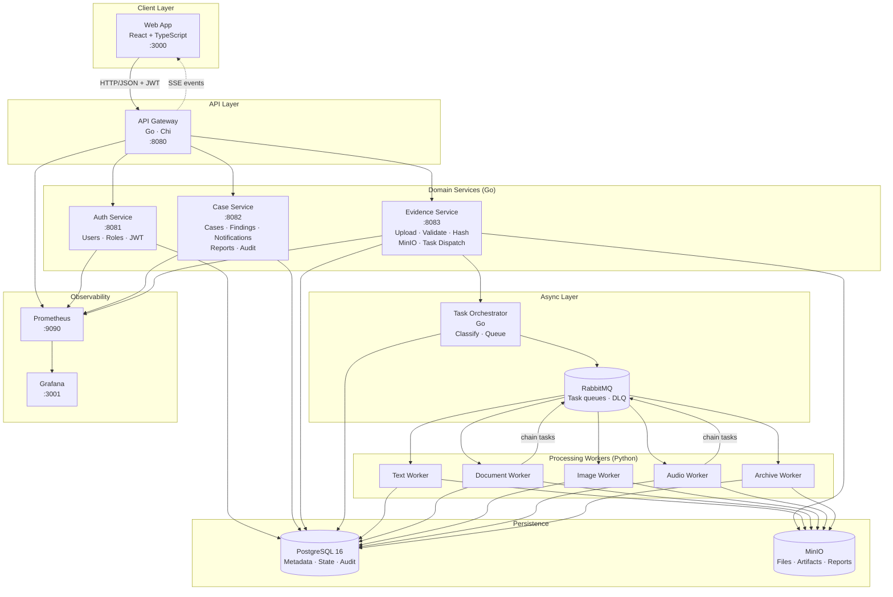
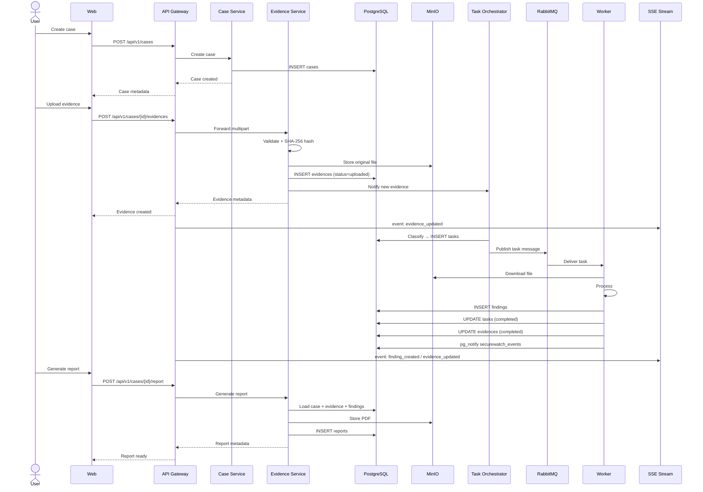

# SecureWatch — Architecture

SecureWatch is a distributed platform for receiving, managing, processing, monitoring, and reporting on digital evidence. The architecture separates the user interface, domain services, asynchronous orchestration, specialized workers, and supporting infrastructure into independent, replaceable components.

---

## Design Principles

- **Single responsibility per service** — each service owns a bounded domain and its data.
- **Asynchronous processing** — workers consume tasks from RabbitMQ queues; the upload path is never blocked by processing.
- **Horizontally scalable workers** — workers are stateless; multiple instances can consume the same queue.
- **Full traceability** — every evidence file has a chain: upload → task → worker → findings → report.
- **Immutable audit trail** — every user-initiated action is recorded in `audit_events` with actor, IP, and timestamp.
- **Real-time feedback** — SSE streams push evidence status, findings, and notifications to the browser without polling.
- **Reproducible local environment** — the full stack runs with `make up` via Docker Compose.

---

## System Overview



---

## Main Flow



---

## Real-Time Events (SSE)

The API Gateway exposes a Server-Sent Events stream per case:

```
GET /api/v1/cases/{caseId}/stream?token=<jwt>
```

PostgreSQL `NOTIFY` on the `securewatch_events` channel propagates events from workers to the gateway, which fans them out to connected browser clients.

| Event type | Trigger |
|---|---|
| `evidence_updated` | Evidence status changes (uploaded → processing → completed) |
| `finding_created` | Worker registers a new finding |
| `task_updated` | Task status changes |
| `notification` | High or critical finding detected |

---

## Authentication & Authorization

All protected endpoints require `Authorization: Bearer <jwt>`.

The API Gateway validates the JWT and injects decoded claims into the `X-User-*` headers forwarded to internal services.

| Role | Permissions |
|---|---|
| `admin` | Full access including user management and audit log |
| `supervisor` | Cases, evidence, reports, audit log (read) |
| `analyst` | Cases and evidence for assigned cases |

---

## Component Responsibilities

| Component | Language | Responsibility |
|---|---|---|
| Web App | React + TypeScript | UI: auth, cases, evidence, findings, reports, notifications, audit |
| API Gateway | Go | Routing, auth middleware, CORS, SSE, reverse proxy, metrics |
| Auth Service | Go | User registration, login, role management, JWT |
| Case Service | Go | Cases, findings, notifications, audit events, reports |
| Evidence Service | Go | Upload, validation, hashing, MinIO, task dispatch |
| Task Orchestrator | Go | Classification, task creation, RabbitMQ publishing |
| Text Worker | Python | Keyword extraction, entity detection, risk scoring |
| Document Worker | Python | PDF/Office text extraction → chains to text worker |
| Image Worker | Python | Object detection, EXIF metadata extraction |
| Audio Worker | Python | Whisper transcription → chains to text worker |
| Archive Worker | Python | Archive contents inspection, suspicious file detection |

---

## Related Documents

- [Container Diagram](container-diagram.md) — detailed C4 container view
- [Architecture Flows](architecture-flows.md) — upload, processing, report sequence diagrams
- [Service Communication](service-communication.md) — communication patterns and rules
- [Database Schema](database-schema.md) — all tables and relationships
- [Workers](workers.md) — worker pipeline and task types
