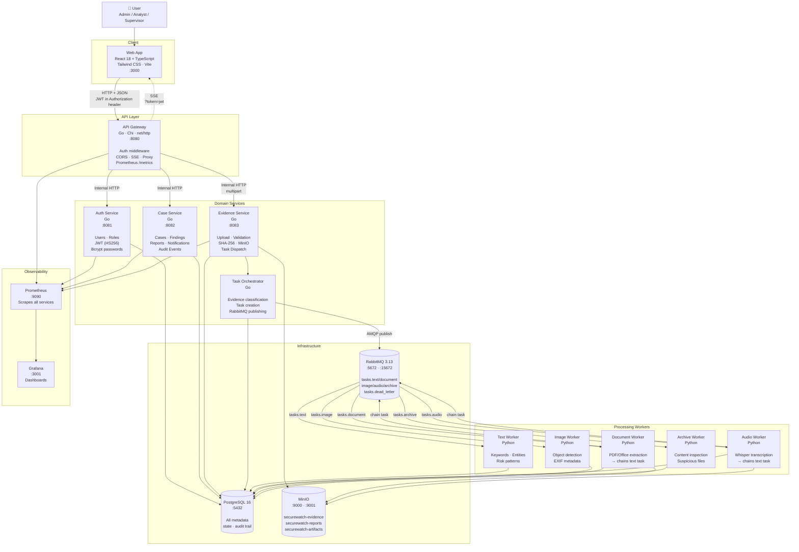

# SecureWatch — Container Diagram

C4-style view of all runtime containers, their responsibilities, and how they communicate.

---

## Full Container Map

---

## Communication Protocols

| From | To | Protocol | Notes |
|---|---|---|---|
| Web App | API Gateway | HTTP/JSON, multipart | All frontend traffic through gateway |
| Web App | API Gateway | SSE (GET + `?token=`) | Real-time events per case |
| API Gateway | Auth/Case/Evidence | Internal HTTP/JSON | Gateway adds `X-User-*` headers |
| Evidence Service | Task Orchestrator | Internal HTTP | Notify after successful upload |
| Task Orchestrator | RabbitMQ | AMQP | Publish task messages |
| Workers | RabbitMQ | AMQP | Consume + ack/nack |
| Workers | PostgreSQL | `pg_notify` | Push SSE events through gateway |
| All services | Prometheus | HTTP `/metrics` | Prometheus text format |

---

## Port Reference

| Container | Port | Purpose |
|---|---|---|
| Web App (dev) | 3000 | Vite dev server |
| API Gateway | 8080 | Public API + SSE |
| Auth Service | 8081 | Internal only |
| Case Service | 8082 | Internal only |
| Evidence Service | 8083 | Internal only |
| PostgreSQL | 5432 | Internal + local access |
| RabbitMQ AMQP | 5672 | Internal |
| RabbitMQ Management | 15672 | Admin UI |
| MinIO API | 9000 | Internal S3 API |
| MinIO Console | 9001 | Admin UI |
| Prometheus | 9090 | Metrics UI |
| Grafana | 3001 | Dashboards |

---

## Container Responsibilities

| Container | Language/Runtime | Key Responsibility |
|---|---|---|
| Web App | React + TypeScript | UI for all user workflows |
| API Gateway | Go | Single entry point, auth, CORS, SSE fan-out |
| Auth Service | Go | User CRUD, JWT issuing, role management |
| Case Service | Go | Case lifecycle, findings API, reports, notifications, audit |
| Evidence Service | Go | Upload, validation, hashing, MinIO storage, task dispatch |
| Task Orchestrator | Go | Evidence classification, task creation, RabbitMQ publish |
| Text Worker | Python | Text analysis: keywords, entities, risk scoring |
| Document Worker | Python | PDF/Office extraction → chains to text worker |
| Image Worker | Python | Object detection, EXIF metadata |
| Audio Worker | Python | Whisper transcription → chains to text worker |
| Archive Worker | Python | Archive inspection, suspicious file detection |
| PostgreSQL | Database | All relational data and pg_notify events |
| RabbitMQ | Message broker | Async task queues + dead letter queue |
| MinIO | Object storage | Evidence files, artifacts, reports |
| Prometheus | Observability | Metrics collection |
| Grafana | Observability | Metrics visualization |

---

## Persistent Volumes

| Volume | Contents |
|---|---|
| `postgres_data` | All database files |
| `rabbitmq_data` | Queue state and definitions |
| `minio_data` | Evidence files, artifacts, reports |
| `prometheus_data` | Metrics time series |
| `grafana_data` | Dashboard state and users |
