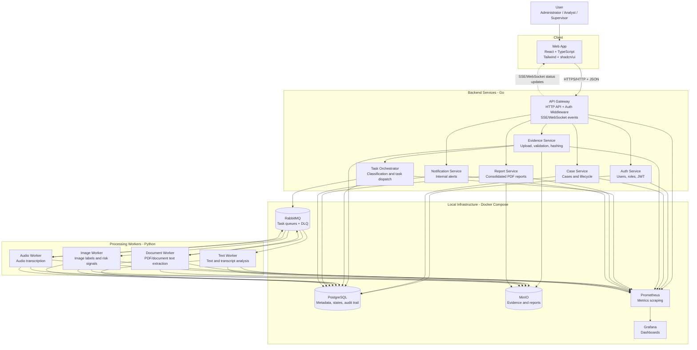

# SecureWatch Container Diagram

This diagram describes the main SecureWatch runtime containers for the MVP. It focuses on local Docker execution, service boundaries, data stores, messaging, and observability.

## Container Responsibilities

| Container | Runtime | Responsibility |
| --- | --- | --- |
| Web App | React + TypeScript | User interface for authentication, case management, evidence upload, dashboard, findings, and reports. |
| API Gateway | Go | Central API entry point, routing, CORS, authentication middleware, request logging, and real-time updates. |
| Auth Service | Go | User registration, sign-in, role management, JWT issuing, and authorization support. |
| Case Service | Go | Case creation, listing, filtering, detail view, updates, status changes, and audit events. |
| Evidence Service | Go | Multipart upload, file validation, SHA-256 hashing, MinIO storage, and metadata persistence. |
| Task Orchestrator | Go | Evidence classification, task creation, RabbitMQ publishing, retries, and dead-letter handling. |
| Text Worker | Python | Text normalization, keyword/category detection, severity calculation, and finding registration. |
| Document Worker | Python | PDF/document text extraction and secondary text-analysis task creation. |
| Image Worker | Python | Basic image analysis, label detection, risk signal detection, and finding registration. |
| Audio Worker | Python | Audio transcription and secondary text-analysis task creation. |
| Report Service | Go | Consolidated report generation, PDF storage, and report metadata management. |
| Notification Service | Go | Internal alerts for high or critical findings and notification state management. |
| PostgreSQL | Database | Persistent metadata, users, cases, evidence, tasks, findings, reports, notifications, and audit logs. |
| RabbitMQ | Message broker | Asynchronous task queues, routing by task type, retries, and dead-letter queue. |
| MinIO | Object storage | Original evidence files, processed artifacts, transcripts, extracted text, and generated reports. |
| Prometheus | Observability | Metrics scraping for services and workers. |
| Grafana | Observability | Dashboards for application and infrastructure metrics. |

## Local Docker Scope

For the MVP, every runtime container should be runnable locally through Docker Compose. Infrastructure containers already exist in the base Compose file. Application containers should be added as each service, worker, and frontend workspace is implemented.

## Related Flows

- [Evidence upload, RabbitMQ processing, and report generation](architecture-flows.md)
- [Service communication rules](service-communication.md)
