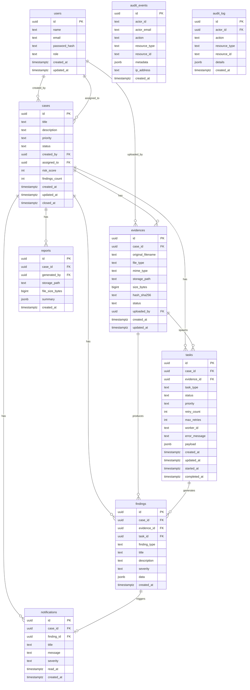
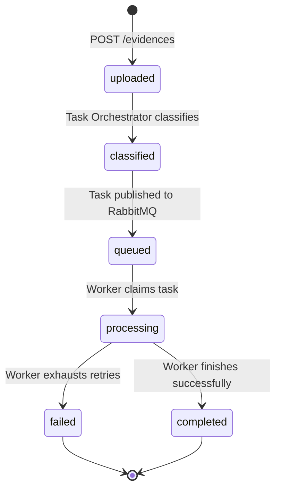
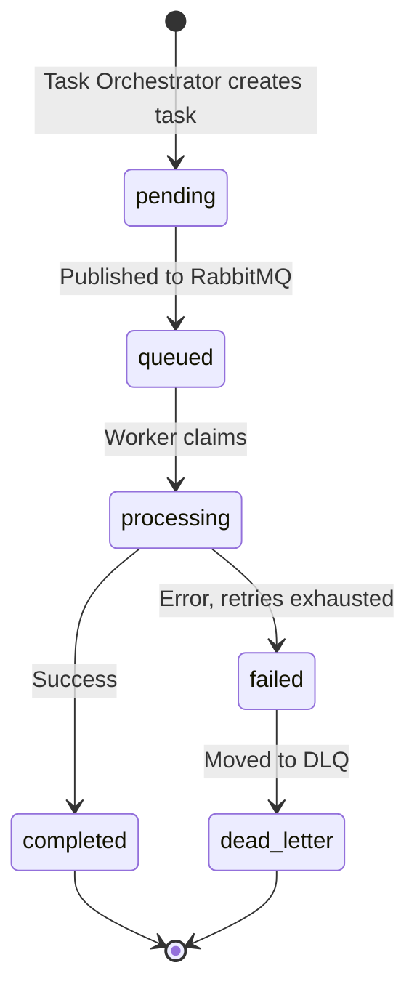

# SecureWatch — Database Schema

All tables live in a single PostgreSQL 16 database (`securewatch`). Migrations are applied in order from `infra/database/init/`.

---

## Entity Relationship Overview

---

## Tables

### `users`
Migration: `001_create_users.sql`

| Column | Type | Notes |
|---|---|---|
| `id` | UUID | Primary key, `gen_random_uuid()` |
| `name` | TEXT | Display name |
| `email` | TEXT | Unique, lowercase |
| `password_hash` | TEXT | bcrypt |
| `role` | TEXT | `admin` / `supervisor` / `analyst` |
| `created_at` | TIMESTAMPTZ | |
| `updated_at` | TIMESTAMPTZ | |

---

### `audit_log`
Migration: `002_add_audit_log.sql`

Legacy audit table with FK to `users`. New audit writes go to `audit_events`.

| Column | Type | Notes |
|---|---|---|
| `id` | UUID | PK |
| `actor_id` | UUID | FK → `users.id` |
| `action` | TEXT | |
| `resource_type` | TEXT | |
| `resource_id` | TEXT | |
| `details` | JSONB | |
| `created_at` | TIMESTAMPTZ | |

---

### `cases`
Migration: `003_create_cases.sql`

| Column | Type | Notes |
|---|---|---|
| `id` | UUID | PK |
| `title` | TEXT | |
| `description` | TEXT | |
| `priority` | TEXT | `low` / `medium` / `high` / `critical` |
| `status` | TEXT | `open` / `in_progress` / `closed` / `archived` |
| `created_by` | UUID | FK → `users.id` |
| `assigned_to` | UUID | FK → `users.id`, nullable |
| `risk_score` | INTEGER | 0–100, updated by workers |
| `findings_count` | INTEGER | Denormalized counter |
| `created_at` | TIMESTAMPTZ | |
| `updated_at` | TIMESTAMPTZ | |
| `closed_at` | TIMESTAMPTZ | Nullable |

Indexes: `status`, `priority`, `created_by`, `created_at DESC`

---

### `evidences`
Migration: `004_create_evidences.sql`

| Column | Type | Notes |
|---|---|---|
| `id` | UUID | PK |
| `case_id` | UUID | FK → `cases.id` |
| `original_filename` | TEXT | |
| `file_type` | TEXT | `text` / `image` / `audio` / `document` / `archive` / `unknown` |
| `mime_type` | TEXT | Detected MIME type |
| `storage_path` | TEXT | MinIO object key |
| `size_bytes` | BIGINT | |
| `hash_sha256` | TEXT | Unique per `(case_id, hash_sha256)` |
| `status` | TEXT | `uploaded` → `classified` → `queued` → `processing` → `completed` / `failed` |
| `uploaded_by` | UUID | FK → `users.id` |
| `created_at` | TIMESTAMPTZ | |
| `updated_at` | TIMESTAMPTZ | |

Indexes: `case_id`, `status`, `uploaded_by`, `hash_sha256`

---

### `tasks`
Migration: `005_create_tasks.sql`

| Column | Type | Notes |
|---|---|---|
| `id` | UUID | PK |
| `case_id` | UUID | FK → `cases.id` |
| `evidence_id` | UUID | FK → `evidences.id` |
| `task_type` | TEXT | `text` / `document` / `image` / `audio` / `archive` |
| `status` | TEXT | `pending` → `queued` → `processing` → `completed` / `failed` / `dead_letter` |
| `priority` | TEXT | Inherited from case |
| `retry_count` | INTEGER | Current retry attempt |
| `max_retries` | INTEGER | Default 3 |
| `worker_id` | TEXT | Identity of the worker that claimed the task |
| `error_message` | TEXT | Last error, nullable |
| `payload` | JSONB | Task-specific data |
| `created_at` | TIMESTAMPTZ | |
| `updated_at` | TIMESTAMPTZ | |
| `started_at` | TIMESTAMPTZ | Nullable |
| `completed_at` | TIMESTAMPTZ | Nullable |

Indexes: `evidence_id`, `status`, `case_id`

---

### `findings`
Migration: `006_create_findings.sql`

| Column | Type | Notes |
|---|---|---|
| `id` | UUID | PK |
| `case_id` | UUID | FK → `cases.id` |
| `evidence_id` | UUID | FK → `evidences.id` |
| `task_id` | UUID | FK → `tasks.id`, nullable |
| `finding_type` | TEXT | `transcription` / `risk` / `entities` / `keywords` / `image_objects` / `image_metadata` / `document_metadata` / `document_text` / `archive_contents` / `suspicious_file` / `transcription_warning` |
| `title` | TEXT | Short description |
| `description` | TEXT | Long description, nullable |
| `severity` | TEXT | `low` / `medium` / `high` / `critical` |
| `data` | JSONB | Worker-specific structured result |
| `created_at` | TIMESTAMPTZ | |

Indexes: `case_id`, `evidence_id`, `severity`, `created_at DESC`

---

### `risk_score` additions
Migration: `007_add_risk_score.sql`

Adds `risk_score` and `findings_count` columns to `cases` if not present.

---

### `reports`
Migration: `008_create_reports.sql`

| Column | Type | Notes |
|---|---|---|
| `id` | UUID | PK |
| `case_id` | UUID | FK → `cases.id` |
| `generated_by` | UUID | FK → `users.id` |
| `storage_path` | TEXT | MinIO object key |
| `file_size_bytes` | BIGINT | |
| `summary` | JSONB | `{ case_title, priority, status, risk_score, evidences_count, findings_count, critical, high, medium, low }` |
| `created_at` | TIMESTAMPTZ | |

Indexes: `case_id`, `created_at DESC`

---

### `notifications`
Migration: `009_create_notifications.sql`

Created automatically when a worker registers a `high` or `critical` finding.

| Column | Type | Notes |
|---|---|---|
| `id` | UUID | PK |
| `case_id` | UUID | FK → `cases.id` |
| `finding_id` | UUID | FK → `findings.id`, nullable |
| `title` | TEXT | |
| `message` | TEXT | Finding title |
| `severity` | TEXT | `high` / `critical` |
| `read_at` | TIMESTAMPTZ | NULL = unread |
| `created_at` | TIMESTAMPTZ | |

Indexes: `case_id`, partial index on `read_at IS NULL` (unread), `created_at DESC`

---

### `audit_events`
Migration: `010_create_audit_events.sql`

Cross-service audit table. Uses TEXT columns (not UUID FKs) so any service can write without joining the `users` table.

| Column | Type | Notes |
|---|---|---|
| `id` | UUID | PK |
| `actor_id` | TEXT | User UUID as text |
| `actor_email` | TEXT | |
| `action` | TEXT | `case.created` / `case.updated` / `case.status_changed` / `evidence.uploaded` / `report.generated` / `report.downloaded` |
| `resource_type` | TEXT | `case` / `evidence` / `report` |
| `resource_id` | TEXT | UUID of the affected resource |
| `metadata` | JSONB | Action-specific context |
| `ip_address` | TEXT | Nullable |
| `created_at` | TIMESTAMPTZ | |

Indexes: `created_at DESC`, `actor_id`, `(resource_type, resource_id)`, `action`

---

## Evidence Status Flow

---

## Task Status Flow

---

## MinIO Buckets

| Bucket | Contents |
|---|---|
| `securewatch-evidence` | Original uploaded evidence files |
| `securewatch-reports` | Generated PDF reports |
| `securewatch-artifacts` | Worker outputs: transcripts, extracted text, processed images |

Object keys follow the pattern: `{case_id}/{evidence_id}/{filename}` for evidence, `{case_id}/{report_id}.pdf` for reports.
